指尖舞动月华明。键盘墨屏映色
帖
说好不为技术控，我熬夜见你熬夜。

以这句为出发点可以写出一首感情真挚的小诗来

某年某月湖南路，一人称善两人湿。

## All in one place

欢迎来到马特·邓恩的第二大脑！这个里是我的的存储库，写文章没什么水平。

我是一个小可爱，热爱科技和生活 😊

Mizore，也叫雨夹雪，这里是我的个人博客，写文章没什么水平，如果有时间会分享一下自己感兴趣的东西和遇到的问题。博客使用的是 Hexo。

## 导航

There are multiple ways to navigate my Second Brain:
有多种方法可以导航我的第二大脑：

Use the search bar on the top right or press cmd+k (ctrl+k on Windows) or click on the Search button (top right) to search for any term.
使用右上角的搜索栏或按 cmd+k （在 Windows 上为 ctrl+k ）或单击“搜索”按钮（右上角）来搜索任何术语。
Click on a note to explore its content, and follow the links and backlinks to dive deeper into related topics.
单击注释以探索其内容，然后单击链接和反向链接以更深入地了解相关主题。
Interact with the graph at the bottom of the page to visualize connections between notes and click on any node to navigate directly to that note.
与页面底部的图表交互以可视化笔记之间的连接，然后单击任何节点直接导航到该笔记。
Click on the Hashtags to explore the topics by tags.
单击主题标签可按标签探索主题。

## # A Single Place for All Data Knowledge
# 所有数据知识的一个地方
Welcome to the Data Glossary, a one-stop-shop for data-related concepts. Inspired by the Digital Garden analogy, this interactive platform offers a comprehensive collection of data terms, covering various topics. The Data Glossary aims to help you expand your data knowledge and uncover new insights. Happy learning!
欢迎使用数据术语表，这是数据相关概念的一站式商店。受数字花园类比的启发，这个互动平台提供了全面的数据术语集合，涵盖各种主题。数据术语表旨在帮助您扩展数据知识并发现新的见解。快乐学习！

# Navigation ＃ 导航
There are multiple ways to navigate my Second Brain:
有多种方法可以导航我的第二大脑：

Use the search bar on the top right or press cmd+k (ctrl+k on Windows) or click on the Search button (top right) to search for any term.
使用右上角的搜索栏或按 cmd+k （在 Windows 上为 ctrl+k ）或单击“搜索”按钮（右上角）来搜索任何术语。
Click on a note to explore its content, and follow the links and backlinks to dive deeper into related topics.
单击注释以探索其内容，然后单击链接和反向链接以更深入地了解相关主题。
Interact with the graph at the bottom of the page to visualize connections between notes and click on any node to navigate directly to that note.
与页面底部的图表交互以可视化笔记之间的连接，然后单击任何节点直接导航到该笔记。
Click on the Hashtags to explore the topics by tags.
单击主题标签可按标签探索主题。

# Map of Content # 内容地图

一些可供探索的链接：

- [写作](https://mizore.cn)
- [编程](https://www.zhihu.com/people/mizore-77)
- [生活](https://weibo.com/u/747474077)
- [AI](https://mizore.cn/images/wechat.jpg)

You are here
In the wilderness of my mind.

Elsewhere 别处
You can receive updates from me via email or follow me:
您可以通过电子邮件接收我的更新或关注我：

Twitter: @kepano 推特：@kepano
GitHub: @kepano GitHub：@kepano
RSS feed: stephanango.com/feed
RSS 提要：stephanango.com/feed
Mastodon: @kepano@mastodon.social

Colophon 版画
This site is published using Obsidian and Jekyll.

- cheatsheets
- /remake
- javascript
- 读书
- 面试
- 算法
- 笔记
- 随笔
- 摘录

  
🌳 <strong>目录</strong>

 

- [All in one place](#all-in-one-place)
- [导航](#导航)
- 
- [/remake](#remake)

- [文件夹](/posts/): a collection of my favourite

See the [documentation](./test/1.md) for how to get [[测试文件#1 | Here's the title override]] started.
See the [Obsidian Help page on Internal Links](https://help.obsidian.md/Linking+notes+and+files/Internal+links)

$$
f(x) = \int_{-\infty}^\infty
    f\hat(\xi),e^{2 \pi i \xi x}
    \,d\xi
$$

## /remake
