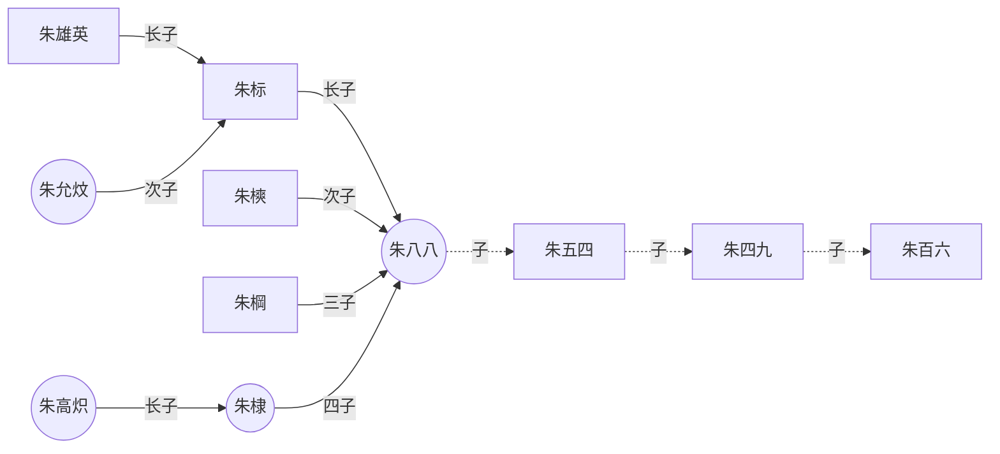
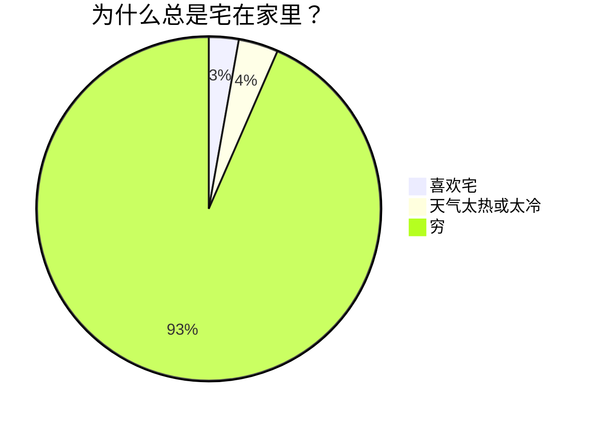

This is a blank Quartz [installation](./2.md).

> [!info] info
>
> This is a callout!
> 钱钱钱

—————

> [!faq]- Are callouts foldable?
> Yes! In a foldable callout, the contents are hidden when the callout is collapsed.

> [!question]- Can callouts be nested?
> > [!todo]- Yes!, they can.
> > > [!example]-  You can even use multiple layers of nesting.

